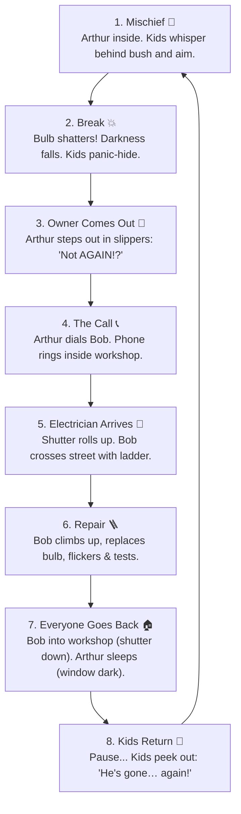

# Leave the Lamp Alone 💡

> **"Three kids. One bulb. One very patient electrician."**  
> A responsive, story-driven animated website and physics simulation set in a quiet Kerala neighborhood at night.

[](https://itsmesyaam.github.io/buld-breaking/)

[](https://developer.mozilla.org/en-US/docs/Web/API/Canvas_API)
[](https://developer.mozilla.org/en-US/docs/Web/API/Web_Audio_API)
[](#)
[](#)

👉 **Experience It Live:** [https://itsmesyaam.github.io/buld-breaking/](https://itsmesyaam.github.io/buld-breaking/)

---

## 📖 The Story & 8-Beat Endless Loop

A quiet street at night. On the left is **Arthur's house** with a porch lamp hanging over the front door. On the right, across the street, is **"Bob's Electricals"**, a small workshop with a glowing neon sign and a corrugated metal shutter. In the middle, behind a garden bush and stone wall, hide three mischievous neighborhood kids: **Rinku**, **Meera**, and **Tuttu**.



### Realistic Spatial Continuity (No Teleportation):
- **Bob** only ever enters and leaves through **his workshop** (shutter rolls up/down).
- **Arthur** only ever enters and leaves through **his front door** (door opens/closes; bedroom window goes dark when he sleeps).
- **The Kids** stay ducked behind cover whenever adults are outside, with only their eyes peeking out.

---

## 🎭 Meet the Cast

| Character | Role | Weapon / Gear | Personality |
| :--- | :--- | :--- | :--- |
| **Arthur** | The Homeowner | Fuzzy Slippers & Flashlight | Just wants one peaceful night of sleep without hearing shattering glass. |
| **Bob** | The Electrician | Folding Ladder & ₹250 Bill | Patient neighbor who keeps replacing the porch bulb every time it breaks. |
| **Rinku** | The Strategist | River Pebble 🪨 (3 hits) | Mastermind behind the bush with pockets full of smooth stones. |
| **Meera** | The Street Captain | Cricket Ball 🏏 (2 hits) | Fast-bowler accuracy; only needs two solid strikes to crack the glass. |
| **Tuttu** | The Crafty One | Origami Paper Plane ✈️ (1 hit) | Folded an aerodynamic paper plane with a rock nose-cone for instant impact. |

---

## 🎮 Modes & Controls

- **▶ Watch Story (Default)**: The 8-beat story loop plays automatically and endlessly with progressive variations (flashlight inspection on repair 5, pillow-hat on repair 7, and near misses).
- **🎯 Play as the Kids**: Take direct control!
  - Pick a kid / throwable: **Rinku (🪨 Pebble)**, **Meera (🏏 Cricket Ball)**, or **Tuttu (✈️ Paper Plane)**.
  - Click or tap anywhere towards the bulb to throw along a physics trajectory.
  - Watch the glass develop cracks before bursting.
  - Once broken, steps 3–8 (owner, phone call, electrician, repair, return) run **automatically** with no user input.
  - Throwing is disabled until the adults go back inside ("Wait till the grown-ups go inside…").
- **Controls Bar**:
  - `⏸ Pause` / `▶ Resume`
  - `⏩ 2x` speed toggle
  - `🔇 Sound: Off` / `🔊 Sound: On` toggle (starts muted per browser autoplay policy)
  - Interactive **Chapter Cards** that highlight in real-time and allow jumping directly to any beat.

---

## ⚙️ Config Values You Can Tweak

All timings, dialogues, prices, and ballistics parameters live in `const CONFIG` inside `<script>` in [`index.html`](file:///h:/buld%20breaking/index.html):

```javascript
const CONFIG = {
  timings: {
    mischiefWhisper: 1800,  // Kids whispering before throw (ms)
    throwFlight: 900,       // Projectile flight time (ms)
    breakShock: 1400,       // Kids gasp & hide (ms)
    ownerOut: 2000,         // Arthur opens door & looks around (ms)
    callPhone: 2400,        // Phone ringing cadence (ms)
    shutterOpen: 1200,      // Workshop shutter rolls up (ms)
    bobWalk: 2400,          // Bob crosses street to house (ms)
    climbLadder: 1800,      // Bob climbs ladder (ms)
    replaceBulb: 2400,      // Unscrew old & screw in new bulb (ms)
    testSwitch: 1600,       // Switch flickers & dialogue (ms)
    bobWalkBack: 2400,      // Bob crosses back to workshop (ms)
    shutterClose: 1200,     // Shutter rolls down (ms)
    ownerGoIn: 1600,        // Arthur enters & window goes dark (ms)
    quietPause: 2200        // Quiet pause before kids return (ms)
  },
  dialogue: {
    kidsWhisper: ["Shh… do it!", "Aim for the middle!", "My turn this time!"],
    kidsGasp: ["Uh-oh!", "Run, hide!", "Duck down!"],
    arthurAngry: ["Not AGAIN!?", "Who is doing this!?", "I need some sleep!"],
    bobReply: ["Coming right over!", "On my way, Arthur!"],
    bobAdvice: ["Keep an eye on those kids, Arthur.", "Third time tonight..."],
    kidsReturn: ["He's gone… again!", "Coast is clear!"]
  },
  billPerRepair: 250,        // Amount added to Bob's bill per repair (₹250)
  currency: '₹',             // Currency symbol
  kidHitPoints: {
    rinku: 1,                // Pebble takes 3 hits (HP: 3 -> 2 -> 1 -> 0)
    meera: 1.5,              // Ball takes 2 hits
    tuttu: 3                 // Plane takes 1 hit (instant break)
  },
  gravity: 1200
};
```

---

## 🔊 100% Procedural Synthesized Audio (Web Audio API)

Zero external audio files! All sounds are procedurally generated in code:
- **Glass Shatter & Tinks**: High-pass noise bursts combined with dual-resonant thumps and multi-sine glass shards.
- **Kids' Giggles**: Playful high-pitched melodic frequency sweeps.
- **Door Creaks & Shutter Roll**: Filtered saw sweeps and corrugated metallic rumble.
- **Phone Ring**: Dual-frequency (440Hz + 480Hz) telephone cadence.
- **Ladder Clanks & Squeaks**: Metallic aluminum resonances and screw friction chirps.
- **Warm 60Hz Power Hum**: Gentle low-frequency drone when the lamp is lit.

---

## 📱 Responsive & Accessible Design

- **Breakpoints**: Optimized for 360px mobile, 768px tablet, 1024px desktop, and 1440px+ ultra-wide.
- **Aspect Ratio Adaptability**: 16:9 on desktop, seamlessly adjusting on mobile screens.
- **Accessibility**: Semantic HTML5 landmarks, visible keyboard `:focus-visible` styling, screen reader narration via `aria-live="polite"`, and `@media (prefers-reduced-motion: reduce)` support.

---

## 📄 License

Open source and distributed under the [MIT License](LICENSE).
