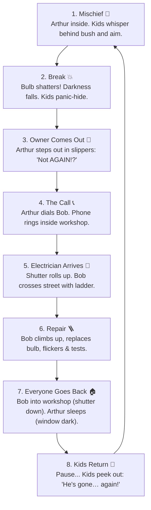

# Leave the Lamp Alone 💡

> **"Three kids. One bulb. One very patient electrician."**  
> A responsive, story-driven animated website and physics simulation set in a quiet Kerala neighborhood at night.

[](https://itsmesyaam.github.io/buld-breaking/)

[](https://developer.mozilla.org/en-US/docs/Web/API/Canvas_API)
[](https://developer.mozilla.org/en-US/docs/Web/API/Web_Audio_API)
[](#)
[](#)
[](LICENSE)

👉 **Experience It Live on GitHub Pages:**  
### **[https://itsmesyaam.github.io/buld-breaking/](https://itsmesyaam.github.io/buld-breaking/)**

---

## 📖 The Story & 8-Beat Endless Loop

A quiet street at night. On the left is **Arthur's house** with a porch lamp hanging over the front door. On the right, across the street, is **"Bob's Electricals"**, a small workshop with a glowing neon sign and a corrugated metal shutter. In the middle, behind a garden bush and stone wall, hide three mischievous neighborhood kids: **Rinku**, **Meera**, and **Tuttu**.



### 🚶 Realistic Spatial Continuity (No Teleportation):
- **Bob** only ever enters and leaves through **his workshop** (corrugated shutter rolls up, Bob steps out, and rolls down when he returns).
- **Arthur** only ever enters and leaves through **his front door** (door opens with warm light spill, Arthur steps out, closes door upon return, and bedroom window light dims dark when he goes back to sleep).
- **The Kids** stay ducked behind cover whenever adults are outside, with only their eyes peeking out.

---

## 🎭 Meet the Cast

| Character | Role | Weapon / Gear | Personality & Live Stats |
| :--- | :--- | :--- | :--- |
| **Arthur** | The Homeowner | Fuzzy Slippers & Flashlight | Just wants one peaceful night of sleep without hearing shattering glass outside his bedroom. Tracks *Times woken up*. |
| **Bob** | The Electrician | Folding Ladder & ₹250 Bill | Patient neighbor who keeps replacing the porch bulb every time it breaks. Tracks *Repairs tonight*. |
| **Rinku** | The Strategist | River Pebble 🪨 (3 hits) | Mastermind behind the bush with pockets full of smooth river stones. |
| **Meera** | The Street Captain | Cricket Ball 🏏 (2 hits) | Fast-bowler accuracy; only needs two solid strikes to crack the glass. |
| **Tuttu** | The Crafty One | Origami Paper Plane ✈️ (1 hit) | Folded an aerodynamic paper plane with a rock nose-cone for instant impact. |

---

## 🎮 Modes & Interactive Gameplay

### 1. ▶ Watch Story Mode (Default)
The 8-beat story loop plays automatically and endlessly with progressive comedic variations:
- **Repair 3**: Bob remarks: *"Third time tonight, Arthur…"*.
- **Repair 5**: Arthur emerges holding a **flashlight torch** with an animated beam searching the bushes.
- **Repair 7**: Bob shows up wearing a **pillow-hat** strapped to his head.
- **Random Near Misses (~20%)**: A throw occasionally misses with a metallic *"clink"*, the kids panic-hide, and try again!

### 2. 🎯 Play as the Kids Mode
Take direct control of the prank:
- Pick between **Rinku (🪨 Pebble)**, **Meera (🏏 Cricket Ball)**, or **Tuttu (✈️ Paper Plane)**.
- Tap or click anywhere towards the hanging lamp to throw along a physics-modeled arc.
- The bulb develops spiderweb cracks before shattering into 40+ physics-driven glass shards.
- Once broken, the adult repair sequence (owner out, phone call, electrician arrival, repair, return) triggers **automatically** with zero user input required.
- Throwing is disabled until the adults go back inside, with a helpful tooltip: *"Wait till the grown-ups go inside…"*.

### 3. Controls & HUD
- Glassmorphism top pill showing real-time status: `💡 ON`, `💥 BROKEN`, or `🔧 FIXING`.
- Beat narrator updating with each story beat (e.g., *"📞 Arthur is calling Bob the electrician..."*).
- `⏸ Pause` / `▶ Resume` and `⏩ 2x` speed toggles.
- `🔇 Sound: Off` / `🔊 Sound: On` toggle (audio is muted until first user interaction per Web Audio autoplay policy).
- Live tallies for **Throws**, **Bulbs Broken**, **Repairs by Bob**, and **Bob's Bill** (running ₹250 per repair visit).
- Interactive **8 Chapter Cards** that highlight the active beat in real time and let you jump directly to any story beat.

---

## 🌐 Website Sections

The single-page site includes:
1. **Sticky Header**: Brand logo with animated pulsing bulb, quick navigation links, sound toggle, and mobile slide-in drawer.
2. **Hero Section**: Catchy tagline, feature badges, and direct CTA buttons to jump into watching or playing.
3. **The Animated Stage**: Fixed aspect-ratio stage (16:9 on desktop, adapting responsively on mobile) with volumetric light bloom, SVG scene graph, and Canvas physics.
4. **Chapters Grid**: 8 clickable cards tracking the story progression.
5. **Meet the Cast**: Interactive cards with SVG portraits, character lore, and live dynamic counters.
6. **How It Works**: Clear guide on the physics, hit mechanics, and percussive maintenance.
7. **Footer**: Open-source attribution and repository links.

---

## ⚙️ Config Values You Can Tweak

All gameplay, dialogue, pricing, and timing settings are centralized in `const CONFIG` inside `<script>` in [`index.html`](file:///h:/buld%20breaking/index.html):

```javascript
const CONFIG = {
  timings: {
    mischiefWhisper: 1800,  // Kids whispering before throw (ms)
    throwFlight: 900,       // Projectile flight time (ms)
    breakShock: 1400,       // Kids gasp & hide (ms)
    ownerOut: 2000,         // Arthur opens door & looks around (ms)
    callPhone: 2400,        // Phone ringing cadence (ms)
    shutterOpen: 1200,      // Workshop shutter rolls up (ms)
    bobWalk: 2400,          // Bob crosses street to house (ms)
    climbLadder: 1800,      // Bob climbs ladder (ms)
    replaceBulb: 2400,      // Unscrew old & screw in new bulb (ms)
    testSwitch: 1600,       // Switch flickers & dialogue (ms)
    bobWalkBack: 2400,      // Bob crosses back to workshop (ms)
    shutterClose: 1200,     // Shutter rolls down (ms)
    ownerGoIn: 1600,        // Arthur enters & window goes dark (ms)
    quietPause: 2200        // Quiet pause before kids return (ms)
  },
  dialogue: {
    kidsWhisper: ["Shh… do it!", "Aim for the middle!", "My turn this time!"],
    kidsGasp: ["Uh-oh!", "Run, hide!", "Duck down!"],
    arthurAngry: ["Not AGAIN!?", "Who is doing this!?", "I need some sleep!"],
    bobReply: ["Coming right over!", "On my way, Arthur!"],
    bobAdvice: ["Keep an eye on those kids, Arthur.", "Third time tonight..."],
    kidsReturn: ["He's gone… again!", "Coast is clear!"]
  },
  billPerRepair: 250,        // Amount added to Bob's bill per repair (₹250)
  currency: '₹',             // Currency symbol
  kidHitPoints: {
    rinku: 1,                // Pebble takes 3 hits (HP: 3 -> 2 -> 1 -> 0)
    meera: 1.5,              // Ball takes 2 hits
    tuttu: 3                 // Plane takes 1 hit (instant break)
  },
  gravity: 1200              // Gravitational constant for projectiles & glass
};
```

---

## 🔊 100% Procedural Synthesized Audio (Web Audio API)

Zero external audio files or network requests! Everything is synthesized in real time:
- **Glass Shatter & Shards**: High-pass noise bursts mixed with dual-resonant low-end thumps and high-frequency sine glass tinks.
- **Kids' Giggles**: Playful ascending frequency blips.
- **Door Creak & Shutter Roll**: Filtered saw wave frequency glides and corrugated metallic noise rumble.
- **Telephone Ring**: Dual-frequency (440Hz + 480Hz) cadence.
- **Ladder Clanks & Screws**: Metallic aluminum resonance and squeaky rubber-glass friction chirps.
- **60Hz Bulb Hum**: Warm low-frequency drone when the light is active.

---

## 🚀 Running Locally

No bundlers, no npm install, and no build steps needed.

### Method 1: Open Directly
Double-click [`index.html`](file:///h:/buld%20breaking/index.html) in your file explorer to open it in Chrome, Edge, Firefox, or Safari.

### Method 2: Local Static Server
```bash
# Python 3
python -m http.server 8000

# Node.js
npx serve .
```
Visit `http://localhost:8000` in your browser.

---

## 📄 License

This project is open source and available under the [MIT License](LICENSE).
