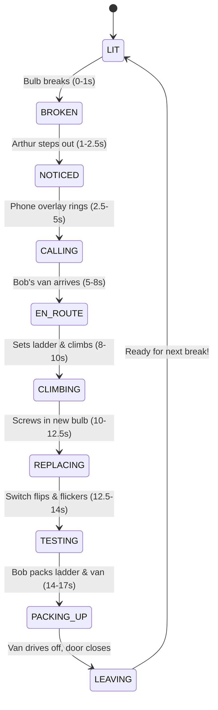

# Leave the Lamp Alone — The Automatic Repair Loop 💡🔧⚡

> A polished, cozy storybook-style interactive animation and physics playground built with vanilla HTML5, CSS, and JavaScript. Break the hanging bulb with throwables (wrenches, hammers, pebbles) to trigger a fully automated 9-stage repair loop where Arthur calls Bob the electrician, who arrives in his utility van, sets up his folding ladder, and performs percussive maintenance!

[](https://itsmesyaam.github.io/buld-breaking/)

[](https://developer.mozilla.org/en-US/docs/Web/API/Canvas_API)
[](https://developer.mozilla.org/en-US/docs/Web/API/Web_Audio_API)
[](#)
[](#)

👉 **Play the Live Experience:** [https://itsmesyaam.github.io/buld-breaking/](https://itsmesyaam.github.io/buld-breaking/)

---

## 🎬 The Automatic Repair Loop (FSM)

Whenever the bulb breaks—either during the scripted **Story Mode** or in **Free Play**—the repair loop starts automatically without requiring any user clicks:



### Scene-by-Scene Breakdown:
1. **BROKEN (0–1s)**: Glass shatters with 40+ physics-driven shards falling and bouncing. The light cuts out, accompanied by procedural glass-break SFX. `Bulbs Broken +1`.
2. **NOTICED (1–2.5s)**: Arthur walks out the front door as warm interior light spills across the deck. He looks up in dismay: *"Oh no… not again!"*
3. **CALLING (2.5–5s)**: A mini phone overlay pops up: *"Calling Bob ⚡ Electrician"*, with pulse ringing and ring SFX. Bob answers: *"On my way!"*
4. **EN_ROUTE (5–8s)**: Bob's electrician van drives in with headlights and low engine hum, then parks. Bob steps out with hard hat, toolbox, and folding ladder.
5. **CLIMBING (8–10s)**: Bob places the ladder under the fixture and climbs up with step-by-step ladder clanks.
6. **REPLACING (10–12.5s)**: Squeaking sound as Bob removes the broken base, then screws in a fresh bulb with a golden chiming sparkle.
7. **TESTING (12.5–14s)**: Bob flips the wall switch. The bulb flickers 2–3 times, then settles into a steady, soft radial bloom. Arthur: *"You're a lifesaver, Bob!"* Bob: *"Anytime. Try not to break it!"* (Or on every 3rd repair: *"Third time this week, Arthur! Added a cage!"*).
8. **PACKING_UP / LEAVING (14–17s)**: Bob climbs down, folds the ladder, drives off, and Arthur returns inside.
9. **LIT**: Idle state restored, ready for the next interaction!

---

## 🕹️ Controls & Features

| Control | Input | Description |
| :--- | :--- | :--- |
| **Throw (Free Play)** | Click & drag / Tap anywhere | Drag for slingshot trajectory with aiming dots, or click directly towards the bulb. |
| **Pick Throwable** | Click toolbar buttons | 🔧 **Wrench** (breaks in 2 hits), 🔨 **Hammer** (breaks in 1 hit), 🪨 **Pebble** (breaks in 3 hits). |
| **Skip Repair ⏩** | Click Skip button | Fast-forwards the active repair sequence at **4x speed**. |
| **Replay Story** | Click Replay button | Plays the scripted intro cutscene from the beginning. |
| **Toggle Mode** | Click Free Play / Story | Switch between free-form throwing sandbox and story mode. |
| **Sound Toggle** | Click Sound button | Mute or unmute procedural Web Audio effects (defaults muted per autoplay policy). |

---

## ⚙️ Config Values You Can Tweak

All timings, costs, and gameplay parameters are centralized in `CONFIG` at the top of `<script>` in [`index.html`](file:///h:/buld%20breaking/index.html):

```javascript
const CONFIG = {
  timings: {
    brokenDuration: 900,     // Glass break & darkness duration (ms)
    noticedDuration: 1500,   // Arthur stepping out duration (ms)
    callingDuration: 2400,   // Phone ring & Bob's reply duration (ms)
    enRouteDuration: 2800,   // Van drive-in and parking duration (ms)
    climbingDuration: 1800,  // Ladder placement & climb duration (ms)
    replacingDuration: 2400, // Socket cleaning & bulb screw-in duration (ms)
    testingDuration: 1500,   // Switch flicker & celebration duration (ms)
    packingDuration: 2800    // Packing up & drive-off duration (ms)
  },
  repairCost: 250,           // Cost per visit added to Bob's invoice (₹250)
  currency: '₹',             // Currency symbol
  hitsToBreak: {
    pebble: 3,               // Number of hits for pebble
    wrench: 2,               // Number of hits for wrench
    hammer: 1                // Number of hits for hammer
  },
  skipMultiplier: 4,         // Fast-forward speed multiplier (4x)
  gravity: 1350              // Pixel physics gravity for canvas throws
};
```

---

## 📐 Architecture & Standards

- **Single Self-Contained File**: Zero build step, zero npm dependencies, runs natively in any browser and GitHub Pages.
- **FSM with Async/Await Timeline**: Clean `wait(ms, signal)` helper backed by an `AbortController` to guarantee no duplicate timers or overlapping audio on replay.
- **Hardware-Accelerated Animation**: Only `transform` and `opacity` are animated via CSS transitions and keyframes for buttery 60fps performance without layout thrashing.
- **Responsive 16:9 & 4:5 Aspect Ratios**: Automatically adapts to desktop screens and mobile portrait displays.
- **Accessibility Built-In**: Keyboard navigable (`:focus-visible`), `aria-live="polite"` beat narration for screen readers, and full compliance with `prefers-reduced-motion`.

---

## 📄 License

Open-source and released under the [MIT License](LICENSE).
